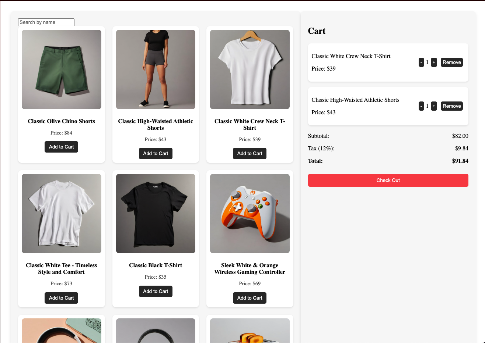

# React + Vite
# Shopping Cart

A simple shopping cart application built with React and Vite, using the Platzi Fake Store API. This app allows users to browse products, add them to a cart, view the cart summary, and proceed to checkout.

## Features

- Search for products by name.
- Add products to the cart.
- View and update the quantity of items in the cart.
- View subtotal, tax, and total in the cart summary.
- Proceed to checkout with a simple payment confirmation.

## Getting Started

### Prerequisites

Ensure you have Node.js and npm installed on your machine. You can download them from [Node.js](https://nodejs.org/).

### Installation

1. **Clone the repository**:

   ```bash
   git clone https://github.com/<your_github_username>/shopping-cart.git

2. **Navigate to the project directory**:

    cd shopping-cart


3. **Install dependencies**:
    npm install

4. **Running the Project**:
    To start the project in development mode, run:
        npm run dev
    This will start the Vite development server. Open your browser and go to http://localhost:5173 to view the application.


Libraries and Tools Used
    Vite - Fast frontend build tool
    React - JavaScript library for building user interfaces
    React Router DOM - Declarative routing for React applications


*Project Structure*
```plaintext
shopping-cart/
├── index.html                # Entry HTML file
├── package.json              # Project configuration and dependencies
├── vite.config.js            # Vite configuration
├── src/
│   ├── App.css               # Global CSS for the application
│   ├── App.jsx               # Main application component with routes
│   ├── main.jsx              # Entry point for the React application
│   ├── components/
│   │   ├── Cart.jsx          # Cart component displaying items in the cart
│   │   ├── CartItem.jsx      # Component for individual items in the cart
│   │   ├── ProductItem.jsx   # Component for individual products
│   │   └── ProductList.jsx   # Component for displaying the list of products
│   └── pages/
│       ├── CheckoutPage.jsx  # Checkout page with order summary
│       └── HomePage.jsx      # Home page displaying products and cart
└── public/
    └── assets/               # Any static assets like images or icons
```plaintext


API
This project uses the Platzi Fake Store API to fetch product data.



This template provides a minimal setup to get React working in Vite with HMR and some ESLint rules.

Currently, two official plugins are available:

- [@vitejs/plugin-react](https://github.com/vitejs/vite-plugin-react/blob/main/packages/plugin-react/README.md) uses [Babel](https://babeljs.io/) for Fast Refresh
- [@vitejs/plugin-react-swc](https://github.com/vitejs/vite-plugin-react-swc) uses [SWC](https://swc.rs/) for Fast Refresh
